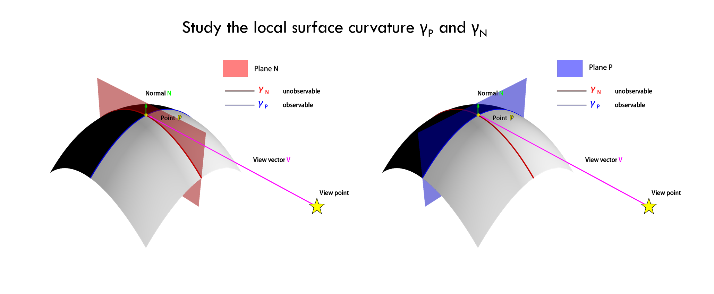
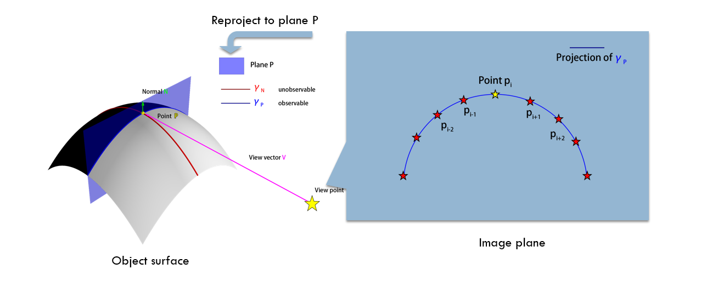
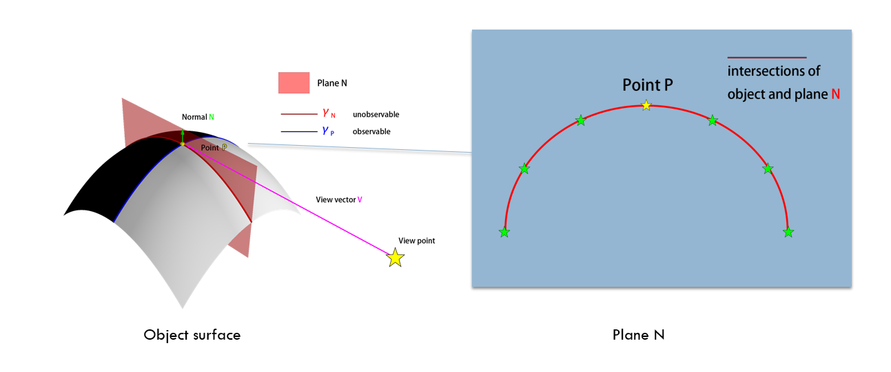
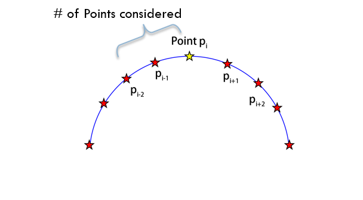

=======
Methods
=======

1. study of the curvature
--------------------------
We start with investigating the relationship between the curvature at each contour vertex and the curvature of the 3D rim, focusing on apparent and normal curvatures.

here is how to define apparent and normal curvature.

For a given point :math:`P_i` on the rim with a view vector :math:`V`, we define a plane :math:`P` perpendicular to the view vector :math:`V`, combined with the normal :math:`N` at point :math:`P`, determines a second orthogonal plane, plane :math:`N`. :math:`\gamma_P` represents the rim's projection onto plane :math:`P` at point :math:`P_i`, while :math:`\gamma_N` is where plane :math:`N` intersects the object surface at point :math:`P_i`. The curvature of :math:`\gamma_P` provides the observable apparent curvature, where the curvature of :math:`\gamma_N` denotes the unobservable normal curvature. Analyzing these two curvatures offers insights into the surface characteristics around point :math:`P_i`

1.1 compute apparent curvature
+++++++++++++++++++++++++++++++++++++++++++++++

To compute the apparent curvature, consider the triplet of image points :math:`p_i`, :math:`p_{i+1}`, and :math:`p_{i-1}` defined by the image projection of :math:`P_i` and its two neighbors. Reprojecting this triplet onto the known plane :math:`P` will yield two local segments of the curve :math:`\gamma_P`. The apparent curvature can be computed by dividing the angle between these two segments by the average length of the reprojected segments.

1.2 compute normal curvature
+++++++++++++++++++++++++++++++++++++++++++++++

The observer cannot directly perceive normal curvature. However, with the ground truth 3D mesh, we can identify the intersection of plane :math:`N` at point :math:`P_i`, intersecting two triangles adjacent to :math:`P_i`. This provides two segments of the curve :math:`\gamma_N`. The normal curvature can be determined by dividing the angle between these segments by the average length of the segments

1.3 scale of the curvature
+++++++++++++++++++++++++++++++++++++++++++++++
The rim and corresponding 2D occluding contours are sampled with the finest detail from the triangular mesh
Then we compute the apparent curvature and normal curvature for each vertex in the rim with different levels of detail.

.. table:: Table: scale of the curvature statistic
   :name: scale of the curvature statistic
   :align: center

   +------------------------+------------------------+
   | # of point considered  |% compare with image    |
   |                        |projection (on average) |
   +========================+========================+
   |1                       | 0.6%                   |
   +------------------------+------------------------+
   |2                       | 1.3%                   |
   +------------------------+------------------------+
   |4                       | 2.6%                   |
   +------------------------+------------------------+
   |8                       | 5.2%                   |
   +------------------------+------------------------+

2. data set choose
----------------------
As our focus is on solid objects represented by meshes, we utilize the Thingi10K dataset, a collection of 3D printing objects. Thingi10K has favorable attributes like vertex and edge manifold, no self-intersections, and no face degeneracy. These characteristics will aid in deriving robust results from the dataset

2.1 data set statistic
+++++++++++++++++++++++++++++++++++++++++++++++
For 4552 synthetic objects with desired properties in the Thingi10K, we randomly sampled 500 objects. For each object, we generate 10 random contour projections From a random view angle.

.. table:: Table: 3D objects statistic
   :name: 3D objects statistic
   :align: center

   +------------------------+----------+----------+-------------------+
   |                        | #Faces   |#Vertices |#Contours Vertices |
   |                        |          |          |                   |
   +========================+==========+==========+===================+
   |Total                   | 7,564,995|3,778,812 |758,772            |
   +------------------------+----------+----------+-------------------+
   |Average                 |15,130    |7,557     |151                |
   |(pre object/projection) |          |          |                   |
   +------------------------+----------+----------+-------------------+

3 image projections
----------------------

Perspective projections were formed using a virtual pinhole camera with a unit focal length and 45° FOV. Objects were centered on the optic axis with a centroid at 1 unit length from the camera.
The size of each object was adjusted so that the object was just contained within the field of view, grazing the frustum at at least one point
